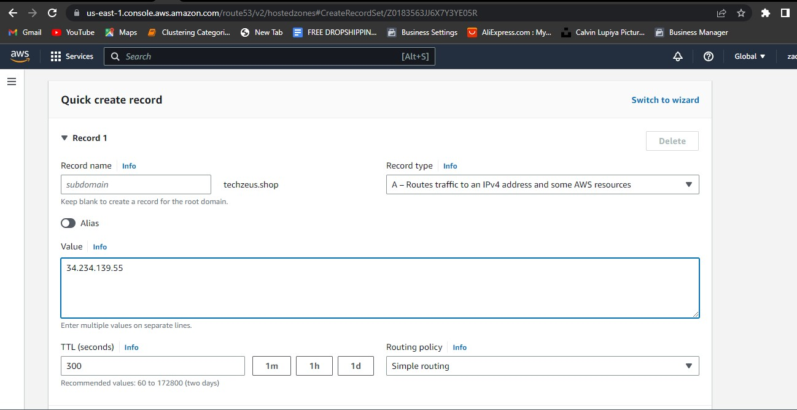
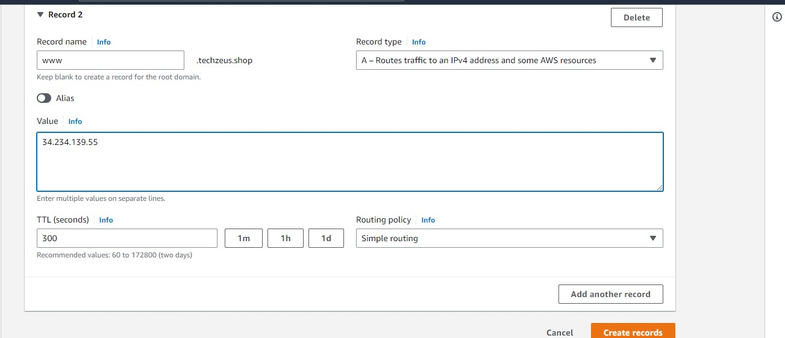
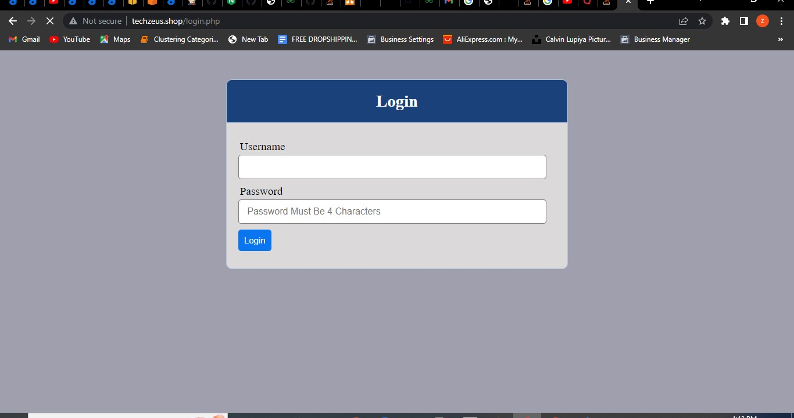

# LOAD BALANCER SOLUTION WITH NGINX AND SSL/TLS
### In this project you will
- Configure Nginx as a Load Balancer
- Register a new domain name and configure secured connection using SSL/TLS certificates

### create an ubuntu instance and install nginx
`sudo apt update`
`sudo apt install nginx`

### edit and etc/hosts file of the nginx server and add the webservers ip address
 

### now create a configuration for our reverse proxy settings. Baiscally you are creating a config file in the nginx sites-available directory
`sudo vi /etc/nginx/sites-available/loadbalancer.conf`

```
#insert following configuration into http section

 upstream tool {
    server web1 weight=5;
    server web2 weight=5;
    server web3 weight=5;
  }

server {
    listen 80;
    server_name techzeus.shop www.techzeus.shop;
    location / {
      proxy_pass http://tool;
    }
  }

#comment out this line
#       include /etc/nginx/sites-enabled/*;
```

### Remove the nginx default default site so traffic is directed to your newly configured site

`sudo rm -rf /etc/nginx/sites-enabled/default`

### Check that nginx is successfully configured

`sudo nginx -t`


### Navigate to the sites-enabled directory and link your new loadbalancer config file in the sites-available directory to the sites-enabled 

`cd /etc/nginx/sites-enabled/`
`sudo ln -s ../sites-available/loadbalancer.conf .`

### Run ls and your loadbalancer.conf file should now be in the directory

`ls -l`


### Reload nginx

`sudo systemctl restart nginx`
`sudo systemctl status nginx`

### Register a new domain name, allocate an elastic IP address to your aws account and associate the elastic IP to your nginx load balancer. Then associate your domain name with this Elastic IP

### After registering a new domain, Go to route 53 on your aws account and create a hosted zone. 
 

### Proceed to add your domain name. Since it is a public hosted domain, traffic will be routed via the internet.


### Notice that after creating your domain, 2 records are automatically added. The NS (Name Servers) record show the nameservers of your hosting provider i.e aws. Thus you will have to manually copy these nameservers address and add them to you domain under the nameservers section. 
### To elaborate further, Name servers are a type of record of the DNS.

### Name servers basically act like the contacts on your phone, contacts contain the names of people and their phone number, so when you go to your contacts and dial a name, your contacts retrieves their phone number and dial the phone number. In the same sense Name servers hold records of a domain (or domains) and it's corresponding ip-address. 

### Thus after adding the name servers of your hosting provider( aws in this case) to your domain, when a browser tries to access your domain name, the DNS first routes the traffic to the specified name servers of the domain, the nameservers (aws name servers in this case) then resolve your domain name and produces your ip-address which is then dialled to get to your webpage  

### Note that nameservers are usually more than one for redundancy 


### Proceed to create 2 records to point to your nginx LB public Ip. use the elastic IP-address





### Now you have successfully first:
- routed traffic from your domain to the nameservers of your hosting provider.
- Configured your hosting provider to return the elastic ip address of your nginx loadbalancer for any request that it receives from your domain.

### Wait for DNS propagation.DNS propagation is the time DNS changes take to be updated across the internet on the globe. It may take up 5-48hrs. Use the "dnschecker.org" website to check if yourdns has been propagated

### Try to access your domain from your browser and see if it returns the nginx default page.



### Now to make our domain secure. Install certbox and request for a digital certificate

### Make sure snapd is running

`sudo systemctl status snapd`

### Install certbox
`sudo snap install --classic certbot`

### request your certificate. follow the instructions and prompt
```
sudo ln -s /snap/bin/certbot /usr/bin/certbot
sudo certbot --nginx
```


### Test secured access to your domain


### By default the LetsEncrypt certificate is valid for only 90 days and has to be renewed. Set up periodical renewal
### Configure a cronjob to run the renewal command twice a day

### First edit the crontab file

`crontab -e`

### Add the following line

`* */12 * * *   root /usr/bin/certbot renew > /dev/null 2>&1`


